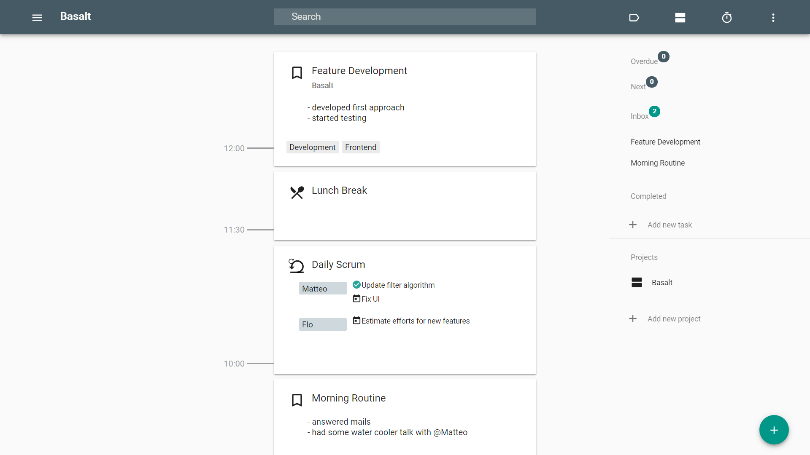
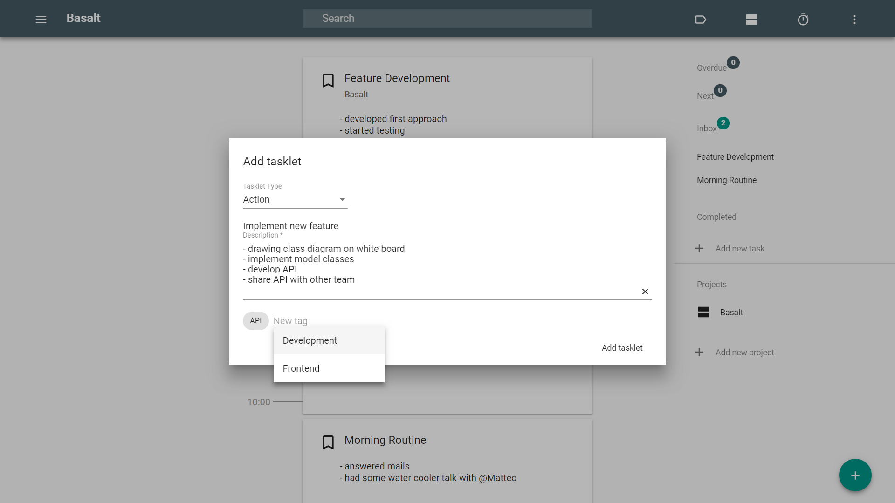
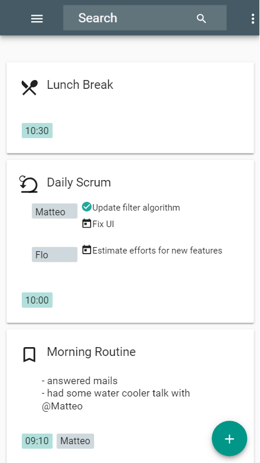

# Basalt


Basalt is available as
* a web app
* a progressive web app
* an Android app

Visit [https://basalt.intero.berlin/](https://basalt.intero.berlin/) for a live demo.

## Purpose

Basalt is an Angular based web application that helps you structure your work in a multi-tasking environment - you may call it a have-done list.





In order to structure your work you can note what you just did as a _tasklet_ which is a small work item belonging to a larger topic. That way you keep track of
* all your current tasks
* meeting minutes
* todos
* ideas

Find all your tasklets by
* tags
* projects
* full-text search

Don't miss any important information. Be able to report what you spent your time with. Keep your head free to focus on things that matter most.

### Features

| Tag       | Feature         |
| ------------- |-------------|
| 0.1 | Display tasklets |
| 0.2 | Specialize tasklets TODO |
| 0.3 | Tag tasklets |
| 0.4 | Search tasklets |
| 0.5 | Display TODOs |
| 0.6 | Show splash screen |
| 0.7 | Update time |
| 0.8 | Attach participants |
| 0.9 | Continue tasklets |
| 0.10 | Show app information |
| 0.11 | Specialize tasklets daily scrum |
| 0.12 | Assign tasklets to projects |
| 0.13 | Infer tags and persons |
| 0.14 | Delete tasklets |
| 0.15 | Update date |
| 0.16 | Import/export tasklets |
| 0.17 | Effort reports |
| 0.18 | Top-level tasks |
| 0.19 | Progressive Web App |
| 0.20 | Android App |
| 0.21 | Hidden toolbar |
| 0.22 | Date indicator |
| 0.23 | Work life distinction |
| 0.24 | Top-level tags and persons |
| 0.25 | Recurring tasks |
| 0.26 | Future tasklets |
| 0.27 | Task delegation |
| 0.28 | Meeting minutes |
| 0.29 | Tasklet type groups |
| 0.30 | Pomodoro mode |
| 0.31 | Markdown support |
| 0.32 | Integrated filtering |
| 0.33 | Safety net |
| 0.34 | Feature toggle |
| 0.35 | Task history |
| 0.36 | Task suggestions |
| 0.37 | Today / later |
| 0.38 | Tag inheritance |
| 0.39 | Definition of done |
| 0.40 | Checklist tasklets |

### Planned features

* tasklet aggregation
* calender view
* multi-device synchronization
* code snippet formatting

### Based on Amphibian

This app is powered by the [Amphibian app template](https://github.com/florianschwanz/amphibian).
Therefore it can be built for the following platforms

* web
* Linux / Windows / MacOS
* Android / iOS

See the Amphibian manual for further information.

## Development

Call the following commands to build and start the app locally
```
npm install
npm run start
```

img[src~="thumbnail"] {
   width:150px;
   height:100px;
}
